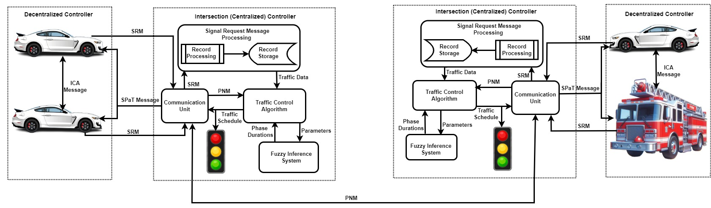

# Fuzzy Logic-based Intersection Management using V2X 
The challenge of road traffic delays persist even with various modern solutions that have been proposed. Thus, this research proposes a Fuzzy Logic-based solution that takes advantage of the Vehicle-to-Everthing (V2X) communication. The research resulted in two publications, which are listed below.
<ol>
  <li>
    A Hybrid Autonomous Intersection Management for Minimizing Delays Using Fuzzy Logic 
    <a href="#ref1">[1]</a>. 
    This paper proposes the fuzzy logic approach for minimization of traffic delays relying on connected vehicles. The assessment of the performance of the approach against static/fixed-time approaches and a recently proposed approach on an isolated intersection was performed and results show significant improvement of our approach at minimizing delays and improving throughput.
  </li>

  <li>
    Minimizing Network-wide Traffic Delays For Priority Vehicles Using I2I Communication <a href="ref2">[2]</a>. 
    This paper extends the previous paper <a href="#ref1">[1]</a> to allow for multi-intersection communication to minimize delays both for non-priority and high-priority vehicles in a traffic network. The assessment of the proposed approach against the regular preemptive approach shows that our proposed approach achieved better performance, minimizing delays and improving throughput.
  </li>
</ol>

The combined results obtained in <a href="ref1">[1]</a> and <a href="ref2">[2]</a> produced the thesis that partially fulfilled the requirements for the award of Masters of Applied Science (MASc) in Electrical and Computer Engineering. Thesis Title: "Fuzzy Logic-Based Intersection Management for Delay Minimization in Intelligent Transportation Systems Using V2X Communication" <a href="ref3">[3]</a>.

### Documentation
To reproduce the research, clone the repository to your local computer and extract (unzip) its contents.
The directory should look as follows:

/FLIM-VITS-

|___TrafficLightsApp

|___mosaic

The "TrafficLightsApp" directory contains the Java codes used to instantiate and control the simulation elements while the "mosaic" directory contains the simulation configurations and their dependencies.

### FLIM-VITS Framework
[Zoom-In for clearity of Figure]

### Fuzzy Inference System/Architecture

#### Fuzzy Rules
| QueueLength | Distance | Speed     | WaitingTime | PhaseDuration |
|-------------|----------|-----------|-------------|----------------|
| short       | near     | slow      | short       | short          |
| short       | near     | slow      | long        | short          |
| short       | near     | slow      | verylong    | short          |
| short       | near     | fast      | short       | short          |
| short       | near     | fast      | long        | short          |
| short       | near     | fast      | verylong    | short          |
| short       | near     | veryfast  | short       | short          |
| short       | near     | veryfast  | long        | short          |
| short       | near     | veryfast  | verylong    | short          |
| short       | far      | slow      | short       | long           |
| short       | far      | slow      | long        | long           |
| short       | far      | slow      | verylong    | long           |
| short       | far      | fast      | short       | long           |
| short       | far      | fast      | long        | long           |
| short       | far      | fast      | verylong    | long           |
| short       | far      | veryfast  | short       | long           |
| short       | far      | veryfast  | long        | long           |
| short       | far      | veryfast  | verylong    | long           |
| short       | veryfar  | slow      | short       | verylong       |
| short       | veryfar  | slow      | long        | verylong       |
| short       | veryfar  | slow      | verylong    | verylong       |
| short       | veryfar  | fast      | short       | verylong       |
| short       | veryfar  | fast      | long        | verylong       |
| short       | veryfar  | fast      | verylong    | verylong       |
| short       | veryfar  | veryfast  | short       | verylong       |
| short       | veryfar  | veryfast  | long        | verylong       |
| short       | veryfar  | veryfast  | verylong    | verylong       |
| long        | near     | slow      | short       | short          |
| long        | near     | slow      | long        | short          |
| long        | near     | slow      | verylong    | short          |
| long        | near     | fast      | short       | short          |
| long        | near     | fast      | long        | short          |
| long        | near     | fast      | verylong    | short          |
| long        | near     | veryfast  | short       | short          |
| long        | near     | veryfast  | long        | short          |
| long        | near     | veryfast  | verylong    | short          |
| long        | far      | slow      | short       | long           |
| long        | far      | slow      | long        | long           |
| long        | far      | slow      | verylong    | long           |
| long        | far      | fast      | short       | long           |
| long        | far      | fast      | long        | long           |
| long        | far      | fast      | verylong    | long           |
| long        | far      | veryfast  | short       | long           |
| long        | far      | veryfast  | long        | long           |
| long        | far      | veryfast  | verylong    | long           |
| long        | veryfar  | slow      | short       | verylong       |
| long        | veryfar  | slow      | long        | verylong       |
| long        | veryfar  | slow      | verylong    | verylong       |
| long        | veryfar  | fast      | short       | verylong       |
| long        | veryfar  | fast      | long        | verylong       |
| long        | veryfar  | fast      | verylong    | verylong       |
| long        | veryfar  | veryfast  | short       | verylong       |
| long        | veryfar  | veryfast  | long        | verylong       |
| long        | veryfar  | veryfast  | verylong    | verylong       |
| verylong    | near     | slow      | short       | long           |
| verylong    | near     | slow      | long        | long           |
| verylong    | near     | slow      | verylong    | long           |
| verylong    | near     | fast      | short       | long           |
| verylong    | near     | fast      | long        | long           |
| verylong    | near     | fast      | verylong    | long           |
| verylong    | near     | veryfast  | short       | long           |
| verylong    | near     | veryfast  | long        | long           |
| verylong    | near     | veryfast  | verylong    | long           |
| verylong    | far      | slow      | short       | verylong       |
| verylong    | far      | slow      | long        | verylong       |
| verylong    | far      | slow      | verylong    | verylong       |
| verylong    | far      | fast      | short       | verylong       |
| verylong    | far      | fast      | long        | verylong       |
| verylong    | far      | fast      | verylong    | verylong       |
| verylong    | far      | veryfast  | short       | verylong       |
| verylong    | far      | veryfast  | long        | verylong       |
| verylong    | far      | veryfast  | verylong    | verylong       |
| verylong    | veryfar  | slow      | short       | verylong       |
| verylong    | veryfar  | slow      | long        | verylong       |
| verylong    | veryfar  | slow      | verylong    | verylong       |
| verylong    | veryfar  | fast      | short       | verylong       |
| verylong    | veryfar  | fast      | long        | verylong       |
| verylong    | veryfar  | fast      | verylong    | verylong       |
| verylong    | veryfar  | veryfast  | short       | verylong       |
| verylong    | veryfar  | veryfast  | long        | verylong       |
| verylong    | veryfar  | veryfast  | verylong    | verylong       |

### Reference
  
[1] B. Zachariah, K. Elgazzar, and S. Alwidian, “A hybrid autonomous intersection management for minimizing delays using fuzzy logic,” in 2024 IEEE International Conference on Smart Mobility (SM), 2024, pp. 122–128, 10.1109/SM63044.2024.10733480

[2] B. Zachariah, M. Amr, K. Elgazzar, and S. Alwidian, “Minimizing network-wide traffic delays for priority vehicles using i2i communication,” 2024

[3] B. Zachariah, "Fuzzy Logic-Based Intersection Management for Delay Minimization in Intelligent Transportation Systems Using V2X Communication," M.A.Sc. thesis, Faculty of Science and Engineering, Ontario Tech University, Oshawa, ON, Canada, 2024. [Online]. Available: https://hdl.handle.net/10155/1909

